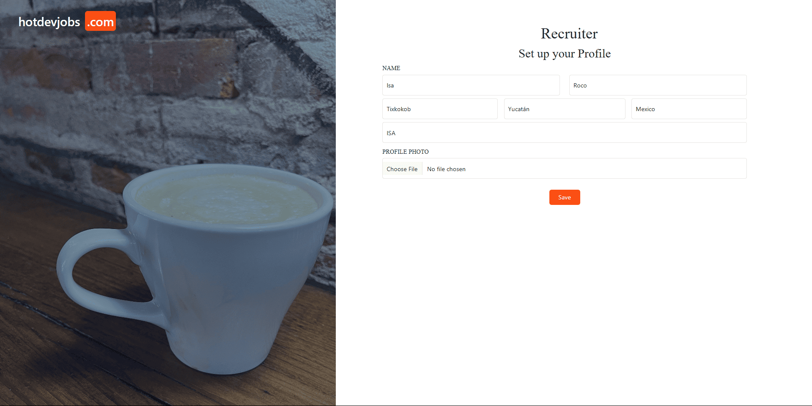

# 💼 Job Portal Web Application

**JobPortal** is a full-stack web application developed using **Spring Boot**, **Thymeleaf**, and **MySQL**. It allows **recruiters** to post job offers and **candidates** to apply with resumes and profile pictures.

---

## 🚀 Technologies
- Java 17
- Spring Boot 3 (MVC, Security)
- Spring Data JPA (Hibernate)
- Thymeleaf
- MySQL
- Bootstrap 5
- Maven7

---

## ✨ Key Features
- User registration and login (candidates and recruiters)
- Role-based access control (RBAC) with Spring Security
- Recruiters can:
  - Create and update job offers
- Candidates can:
  - View job listings
  - Apply to jobs
  - Save jobs
  - Upload resumes and profile images
- File upload support (PDF resumes, profile pictures)
- Dynamic homepage based on user role
- Secure session and authentication handling

---

## 🖼️ Screenshots

### 🏠 Home Page


### 🔐 Login Page


### 🔑 Register Page


### 👤 Candidate Dashboard


### 👔 Job Details


### 📌 Saved Jobs


### 👤 Candidate Profile


### 💼 Recruiter Dashboard


### 💼 Recruiter Profile


### ✏️ Post New Job


---

## 🧪 Database

This project includes two SQL scripts to help you set up the MySQL database quickly:

1. Create the Database User

Run this script to create a MySQL user with full privileges:

File: `00-create-user.sql`

    -- Drop the user if it already exists
    DROP USER IF EXISTS 'jobportal'@'%';
    -- Create a new user with full privileges
    CREATE USER 'jobportal'@'localhost' IDENTIFIED BY 'jobportal';
    GRANT ALL PRIVILEGES ON * . * TO 'jobportal'@'localhost';

💡 You can customize the **username** and **password** as needed.

---

2. Create the jobportal Database and Tables

This script creates the full schema and seed data for the application:

File: `01-jobportal.sql`

* Drops and recreates the jobportal database

* Creates all required tables (users, job_post_activity, job_seeker_profile, etc.)

* Seeds initial data (e.g., user types: Recruiter and Job Seeker)

---

## ⚙️ Getting Started
1. Clone the repository:
   ```bash
   git clone https://github.com/tuusuario/jobportal.git

2. Configure your MySQL database in `src/main/resources/application.properties`:
    ```bash
    spring.datasource.url=jdbc:mysql://localhost:3306/jobportal
    spring.datasource.username=your_mysql_user
    spring.datasource.password=your_mysql_password


3. Run the application:
    ```bash
    ./mvnw spring-boot:run

---

## 📁 Project Structure

* controller/ – Spring MVC controllers
* config/ – Security and MVC config
* entity/ – JPA entities
* repository/ – Spring Data repositories
* templates/ – Thymeleaf templates
* static/ – CSS, JS, images

---

## 🔧 Upcoming Features

The following features are currently planned and will be implemented in future updates:

* ✅ Email verification and password reset flow
    Allow users to verify their email address and reset their password securely via email.

* ✅ Enable job editing and deletion from the Job Details page
    Allow recruiters to manage postings more efficiently without navigating back to the dashboard.

* ✅ REST API endpoints
    Expose public/private APIs to allow external systems to interact with job postings and applications.

---

## 👤 Author

* Eduardo Rodríguez Couoh

    Java Backend Developer | Software Engineer

    [LinkedIn Profile](https://www.linkedin.com/in/eduardo-rodriguez-couoh/)

